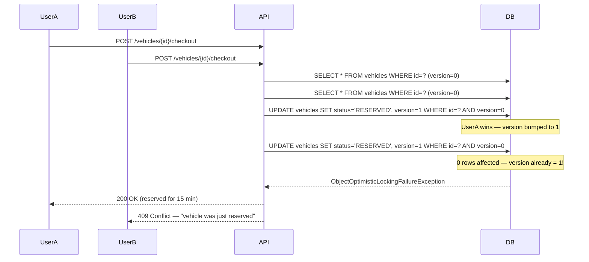
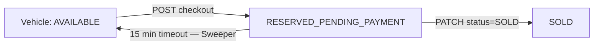

# System Architecture Design

## 1. Overview

The Dealers Auto Center (AC) system is designed as a **modular monolith**. This approach provides the simplicity of a single deployment unit while enforcing strict domain boundaries (Auth, Dealer, Vehicle, Admin) to ensure the system is ready to be split into microservices if scale demands.

---

## 2. Multi-Tenancy Strategy

To securely isolate data between different client networks, we chose a **Discriminator Column** (Single Database, Single Schema) multi-tenant architecture.

- **Header Propagation:** `X-Tenant-Id` is required on all protected routes.
- **Tenant Context:** A `ThreadLocal` context filter captures the tenant per request and clears it after the response.
- **Data Isolation:** All entities implement IDOR protection. Every query explicitly checks `tenant_id` alongside the primary key ensuring data leakage is mathematically impossible.

---

## 3. Security

- **Stateless Authentication:** JSON Web Tokens (JWT) signed with HS256.
- **Rate Limiting:** IP-based token-bucket rate limiting via Bucket4j to prevent brute-force attacks.
- **Role-Based Access Control (RBAC):** `GLOBAL_ADMIN` vs `TENANT_USER` roles explicitly mapped to endpoint authorities via `@PreAuthorize`.
- **Cross-Tenant Access:** Returns `403 Forbidden` to avoid leaking resource existence.

---

## 4. Asynchronous Integrations

Instead of synchronous blocking calls, the system uses Spring Application Events to decouple domain logic.

- When a `Vehicle` transitions to `SOLD`, a `DomainEvent` is emitted.
- Async listeners trigger: **Mailgun** emails, **Webhooks**, **Twilio** SMS notifications — without blocking the main request thread.

---

## 5. Audit Strategy (Hybrid Persistence)

To ensure the system remains performant as audit volume grows, we moved auditing to a **NoSQL (MongoDB)** backend.

- **Append-Only:** Audit logs are write-heavy and don't require relational joins.
- **Async Auditing:** Leveraging Spring AOP (`@Audited`), the audit capture happens asynchronously, ensuring 0ms impact on the primary business transaction.
- **Retention:** Combined with structured logging and 31-day log rotation, the system provides full observability for compliance and debugging.

---

## 5. Checkout Reservation Pattern (Concurrency Control)

### The Problem

Multiple users can attempt to purchase the same vehicle simultaneously. Without locks, two users could both read `AVAILABLE`, commit their purchase transactions, and both believe they succeeded. This is a **race condition** (lost update problem).

### The Solution: Optimistic Locking + Timed Reservation

```
User A ──┐
          ├── POST /vehicles/{id}/checkout  ──► status=RESERVED_PENDING_PAYMENT
User B ──┘                                       reservation_expires_at = now + 15min
          │
          └── Both hit at same time?
               @Version column detects concurrent write
               ──► ObjectOptimisticLockingFailureException
               ──► 409 Conflict returned to losing thread
```

#### Mermaid Sequence Diagram



### Reservation Expiry (The Sweeper)

If a user reserves a vehicle but never completes the purchase, `VehicleReservationSweeper` runs every 60 seconds and resets any `RESERVED_PENDING_PAYMENT` with `reservation_expires_at < NOW()` back to `AVAILABLE`. This guarantees no vehicle is permanently stuck.



---

## 6. Background Scheduling

- **Mechanism:** `@EnableScheduling` + `@Scheduled(fixedRate = 60000)` on `VehicleReservationSweeper`.
- **Thread Pool:** Runs on Spring's default single-threaded scheduler. For high-load production, configure a `ThreadPoolTaskScheduler` bean.
- **Observability:** All invocations are logged; metrics exposed via Spring Actuator.

---

## 8. Testing Infrastructure

A unified testing base ensures stability across the entire suite.

- **BaseIntegrationTest:** A single parent class for all `*IT.java` files.
- **Shared Containers:** Uses a singleton container pattern for PostgreSQL and MongoDB, starting them once per suite run.
- **Stability:** Solves common Testcontainers issues like port exhaustion or JVM thread leakage.
- **Coverage:** Integrated JaCoCo in `pom.xml` aggregates coverage from both unit and integration tests, ensuring >80% threshold across core modules.
