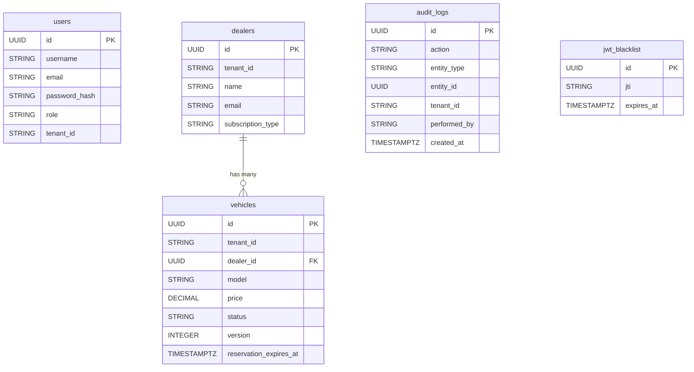

# Database Design

## Tenancy Approach

The system uses **Discriminator Columns** for multi-tenancy across a single PostgreSQL instance. All entities bind `tenant_id` to the authenticated request header value.

---

## Flyway Migrations (Version History)

| Migration | Description |
|-----------|-------------|
| `V1__create_users_table.sql` | Auth users with BCrypt passwords and roles |
| `V2__create_dealers_table.sql` | Dealers with subscription tiers |
| `V3__create_vehicles_table.sql` | Vehicles linked to dealers |
| `V4__create_audit_and_blacklist.sql` | Audit logs + JWT blacklist |
| `V5__create_jwt_blacklist.sql` | JWT blacklist table for token revocation |
| `V6__add_vehicle_reservation_and_locking.sql` | `@Version` column + `reservation_expires_at` for checkout concurrency |
| `V7__increase_vehicle_status_length.sql` | Increas the vehicle status length and updates it check to accommodate new status|

---

## Core Tables

### `users`
- Stores authentication credentials with `BCrypt` hashes and role assignments.
- `tenant_id` determines organizational boundaries.
- **Unique constraint:** `(username, tenant_id)` — same username can exist in different tenants.

### `dealers`
- Represents a physical dealership location.
- **Enums:** `SubscriptionType` (`BASIC`, `PREMIUM`) — enables API feature gating.
- Linked to many vehicles.

### `vehicles`
- Linked to a `dealer_id` (and transitively scoped to `tenant_id`).
- **Enums:** `VehicleStatus` (`AVAILABLE`, `RESERVED_PENDING_PAYMENT`, `SOLD`).
- **`version` (INTEGER):** JPA optimistic lock counter — prevents concurrent writes corrupting the same row.
- **`reservation_expires_at` (TIMESTAMPTZ):** Expiry timestamp for the 15-minute checkout reservation window.
- **Indexes:** Multi-column B-tree index on `(dealer_id, status)` for fast dashboard filtering.

### `audit_logs`
- Append-only event log tracking modifications across any entity via AOP (`@Audited`).
- Fields: `action`, `entity_type`, `entity_id`, `tenant_id`, `performed_by`, `created_at`.

### `jwt_blacklist`
- Stateless JWT tokens can't be mathematically revoked mid-flight.
- This table stores explicitly logged-out `jti` claims until their natural expiry.

---

## Entity Relationship (ERD)

> **Migration Engine:** Managed through Flyway V-scripts in `src/main/resources/db/migration`. All migrations are **irreversible** by convention — new migrations must be created for any schema changes.
